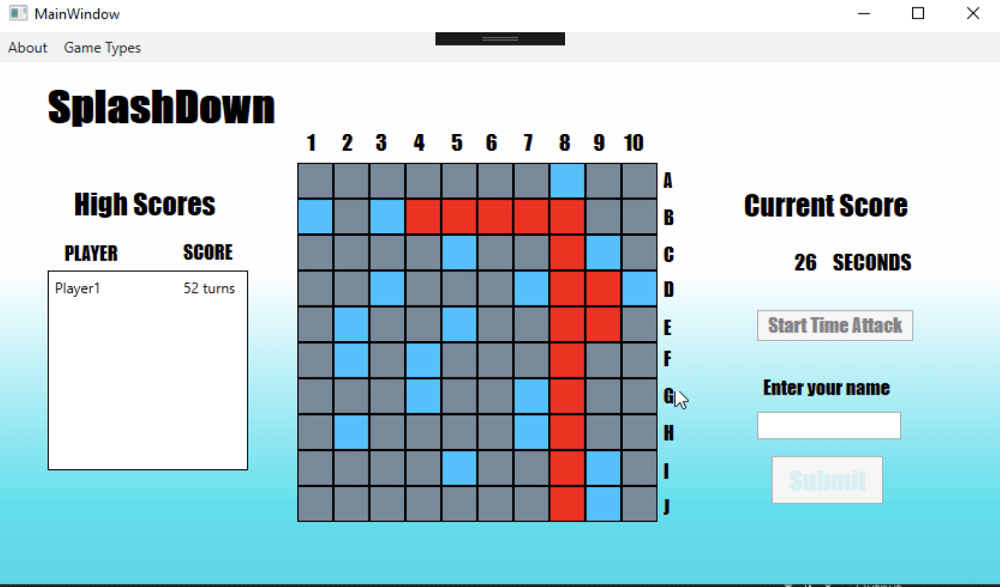

# SplashDown

My final project from my c# class.

Here is a look at the user interface.

### GAME PLAY
This game is similar to how you would play BattleShip. The grid in the middle has 5 different ships ranging in size from 2-5 squares that are hidden at the start.An aircraft carrier is 5 squares long, a battleship is 4 squares long, both a submarine and a destroyer are three squares long and a patrol boat is two squares long. The computer will randomly select different positions on the board for the ships. The user will pick a square at random to fire on. If the AI has any part of one of its ship on it, it is a hit and will be marked on their grid which part has been hit in red. If it is a miss, it will be marked in blue.If the user successfully locates all of the ships by hitting each square they occupy they have won as all ships have been destroyed.
### OBJECTIVE
Take as few turns as possible to hit all the ships. The lower your turn count when you win, the better!
### ALTERNATE GAME MODE: TIME ATTACK
In this mode you battle against the clock to see how fast you can locate all the boats.

_This game was developed by Daniel King as a final project in IT 4400_
